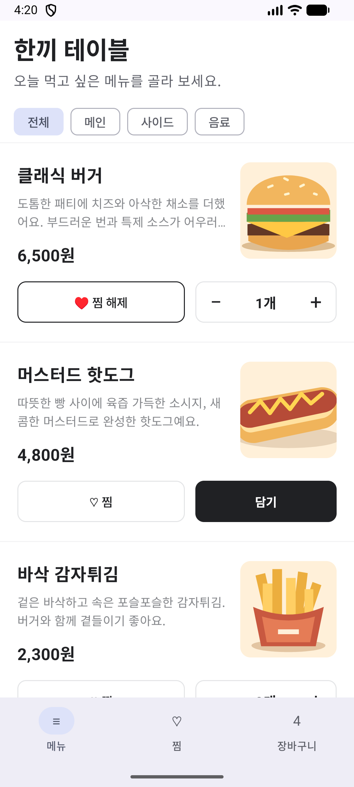
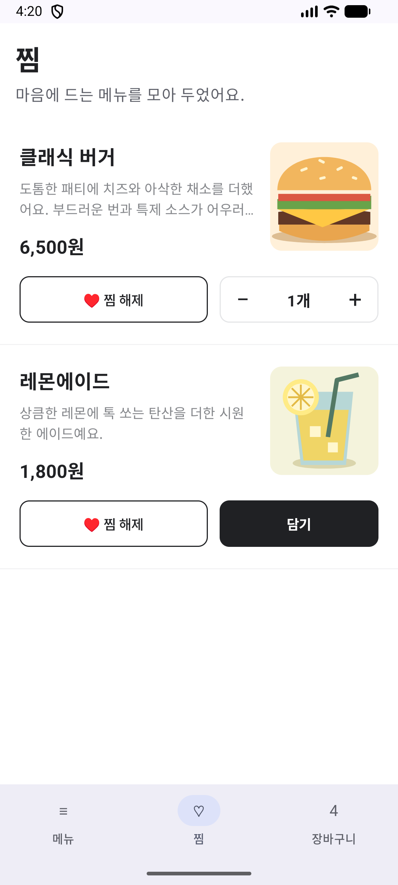
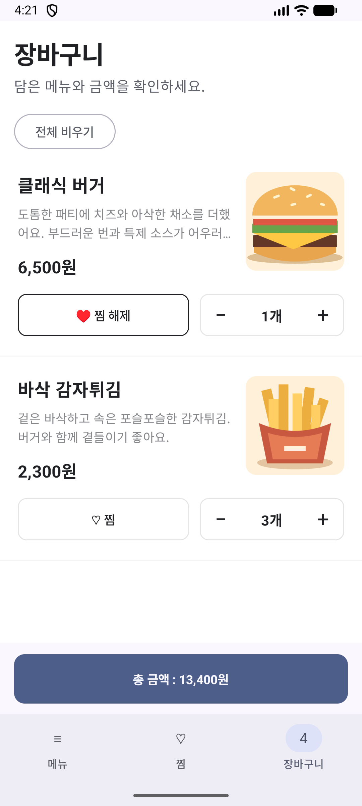

# 과제 2 - 한끼 테이블

한 음식점의 메뉴를 찾아보고, 마음에 드는 메뉴를 찜하고, 장바구니에 담는 **한끼 테이블** 앱을 만들어 봅시다.

주어진 메뉴 데이터를 이용하여 Compose로 화면을 만들고, ViewModel의 상태와 사용자 이벤트를 연결해 봅시다. AI를 이용해 구현해도 됩니다. 사용한 코드는 직접 실행하고 **확인**해 보세요.

이해가 안 가는게 있으면 반드시 모든 코드를 이해하고 넘어가야 합니다.

## 1. 과제의 결과물

앱에는 **메뉴, 찜, 장바구니** 세 화면이 있으며, 하단의 **Bottom Bar**로 전환합니다. 초기 상태는 메뉴 탭, 전체 카테고리, 찜 없음, 빈 장바구니입니다.

### (1) 메뉴 화면

- 음식점 이름 **한끼 테이블**과 **전체, 메인, 사이드, 음료** 카테고리를 표시합니다.
- 전체를 선택하면 모든 메뉴를, 다른 카테고리를 선택하면 해당 메뉴만 표시합니다.
- 메뉴 목록은 배달의민족 메뉴 목록의 배치를 참고하여 구현합니다. **왼쪽에는 이름·설명·가격, 오른쪽에는 모서리가 둥근 정사각형 이미지**를 배치합니다. 이름과 가격은 강조하고, 설명은 최대 두 줄 이후 말줄임 처리합니다. 메뉴 사이는 여백과 구분선으로 구분합니다.
- 각 메뉴의 아래쪽에 **찜 버튼과 담기·수량 조절 영역**을 나란히 배치합니다. 이미지 위에는 버튼을 두지 않습니다. 인기 순위, 리뷰 수, 배달비 배너는 구현하지 않습니다.
- 수량이 0이면 **담기** 버튼을 표시합니다. 누르면 수량이 1이 되고, 같은 자리가 **`−  1개  +`**로 바뀝니다. 이후 `−`, `+`로 수량을 1씩 변경하고, 0이 되면 다시 담기 버튼으로 돌아갑니다. 전환되어도 조작 영역의 크기와 카드 배치가 흔들리지 않게 합니다.
- 찜 버튼을 누르면 찜 상태가 전환됩니다. 다른 화면에서 바꾼 찜·수량도 즉시 반영합니다.
- 목록 맨 위에서 **아래로 일정 거리 이상 당겼다 놓으면 새로고침 표시를 0.5초 동안** 보여 줍니다. 실제 통신이나 데이터 변경은 하지 않으며 화면을 지웠다 다시 만들지 않습니다. 탭·카테고리·찜·장바구니는 유지하고, 진행 중에는 중복 새로고침을 시작하지 않습니다.

### (2) 찜 화면

- 카테고리와 관계없이 찜한 메뉴만 표시합니다. **메뉴 화면과 동일한 `MenuItemRow` 컴포넌트를 재사용**하여 이름·설명·가격·이미지·찜 버튼·담기/수량 조절 영역을 표시합니다.
- 찜 화면에서도 담기와 수량 증감을 할 수 있습니다.
- 찜을 해제하면 목록에서 즉시 사라지고 메뉴 화면에도 반영됩니다. 장바구니 수량은 바뀌지 않습니다.
- 찜한 메뉴가 없으면 안내 문구를 표시합니다.

### (3) 장바구니 화면

- 수량이 1 이상인 메뉴만 표시합니다. **메뉴·찜 화면과 동일한 `MenuItemRow` 컴포넌트**로 이름·설명·단가·이미지·찜 버튼·수량 조절 영역을 표시합니다. 
- 버튼을 누르면 수량이 1씩 바뀝니다. 수량이 0이면 목록에서 제거하고 음수가 되지 않게 합니다.
- 찜 상태도 변경할 수 있으며 메뉴·찜 화면에 즉시 반영됩니다. 
- 총 가격은 **Bottom Bar 바로 위에 `총 금액 : nnnn원` 버튼**의 형태로 고정하여 표시합니다. 목록을 스크롤해도 버튼은 고정되어 보이고, 수량이 바뀌면 금액도 즉시 갱신됩니다.
- 버튼을 누르면 **`nnnn원 결제 완료!` Toast**를 표시합니다. 버튼과 Toast에는 누른 시점의 동일한 총금액을 사용합니다. 실제 결제·주문 전송은 하지 않으며, 장바구니와 찜은 그대로 유지합니다.
- 전체 비우기 버튼은 별도로 제공합니다. 비우기는 장바구니만 초기화합니다.
- 비어 있으면 안내 문구를 표시하고, `총 금액 : 0원` 버튼은 비활성화합니다. 

**전체 수량 = 모든 상품 수량의 합**, **총가격 = 각 상품의 (단가 × 수량)의 합**입니다. 배달비·할인·세금은 계산하지 않습니다.

### (4) Bottom Bar

- 메뉴, 찜, 장바구니 탭을 항상 표시하고 현재 선택된 탭을 구분합니다.
- 장바구니 탭에는 상품 종류 수가 아닌 **전체 수량**을 표시합니다.
- 어느 화면에서 찜이나 수량을 바꾸어도 관련 화면에 즉시 반영되어야 합니다.
- 탭을 바꾸어도 선택 카테고리가 유지되어야 합니다. 탭·카테고리를 바꾸어도 찜과 장바구니는 유지됩니다.
- 화면 회전 후에도 현재 탭, 카테고리, 찜, 장바구니 상태가 유지되어야 합니다.

### 예시 화면

예시 이미지는 [`docs/images/assignment2/`](docs/images/assignment2/)에 있습니다. 클래식 버거 1개와 바삭 감자튀김 3개를 담은 상태로, 전체 수량은 4개, 총금액은 13,400원입니다.

| 메뉴 (`menu.png`) | 찜 (`favorites.png`) | 장바구니 (`cart.png`) |
|---|---|---|
|  |  |  |

[결제 완료 Toast 예시 (`checkout-toast.png`)](docs/images/assignment2/checkout-toast.png)

## 2. 과제 준비

`assignment-2` 브랜치에서 아래 화면 함수의 틀을 바탕으로 앱을 구현합니다. 경로는 `app/src/main/java/com/mca/androidseminar2026/` 기준입니다.

```text
data/MenuData.kt            # 읽기: 메뉴 데이터와 타입
model/OrderTab.kt           # 읽기: 메뉴·찜·장바구니 탭
uistate/                   # 직접 설계한 UiState 정의
ViewModel/                 # 직접 설계한 ViewModel 정의
ui/
├── OrderScreens.kt         # 구현: 세 화면과 Bottom Bar
├── MenuComponents.kt       # 구현: 메뉴 항목과 담기·수량 조절 UI
└── Assignment2Starter.kt   # 구현: ViewModel 상태와 화면 연결
```

**ViewModel과 UiState는 직접 설계하고 필요한 파일을 추가하세요.** 화면에 필요한 상태·콜백 파라미터도 직접 정합니다. 함수 이름이나 파라미터를 바꾸면 호출하는 곳도 함께 수정하세요.

**UiState는 `uistate/` 폴더 안에서만, ViewModel은 `ViewModel/` 폴더 안에서만 정의하세요.** 폴더 이름의 대소문자를 지켜 주세요. 클래스의 개수·이름·역할은 직접 정합니다.

`MenuData.items`에는 3개 카테고리의 메뉴 6개가 있습니다. 각 `MenuItem`은 고유 ID(`id`), 이름(`name`), 설명(`description`), 카테고리(`category`), 원 단위 가격(`price`), 로컬 이미지 ID(`imageResId`)를 갖습니다. 음식점 이름은 `MenuData.restaurantName`입니다.

원본 데이터는 변경하지 않습니다. `app/src/main/res/drawable/menu_*.xml`에 이미지가 준비되어 있으니 `painterResource(menu.imageResId)`를 `Image`에 연결하세요.

## 3. 과제

### (1) 화면과 Bottom Bar 만들기

`OrderScreens.kt`의 세 화면·`BottomBar`·`CheckoutButton`, `MenuComponents.kt`의 `MenuItemRow`·`QuantitySelector`를 구현하세요. **메뉴·찜·장바구니 세 화면 모두 같은 `MenuItemRow`를 호출**하고, 필요한 상태와 이벤트 콜백을 전달합니다. 화면마다 항목 UI를 복사하거나 찜·수량을 UI 내부에 별도로 저장하지 마세요.

앱 전체에서 **Text, Image, Button, Row, Column, Spacer, Modifier**를 각각 사용하세요. 추가 Compose 부품과 스타일은 자유롭게 선택해도 됩니다.

`Assignment2Starter`에서 현재 탭 상태와 조건 분기로 화면을 전환하세요.

### (2) 상태 관리 구조 설계하기

앱에 필요한 상태와 사용자 이벤트를 정리하고, **여러 ViewModel로 책임을 나누세요.** ViewModel의 개수·이름·담당 상태·이벤트 함수와 UiState의 구조는 직접 설계합니다.

### (3) 여러 화면에 상태 연결하기

`Assignment2Starter`에서 상태를 수집하고 UI와 이벤트를 연결하세요. 어떤 UI가 어떤 ViewModel을 사용할지도 직접 정하세요.

### (4) 참고사항

강의에 없던 Compose 부품이나 컬렉션의 필터링·정렬·매핑·합계 API도 찾아서 사용해도 됩니다.

당겨서 새로고침하는 Compose 부품을 찾아 사용해도 됩니다. 0.5초 대기는 UI를 멈추지 않는 방식으로 구현하세요.

## 4. 제출하기

저장소를 fork한 뒤, 본인 원격 저장소의 `assignment-2` 브랜치에서 와플스튜디오 원본 원격 저장소의 `assignment-2` 브랜치로 PR을 보내 주세요.
